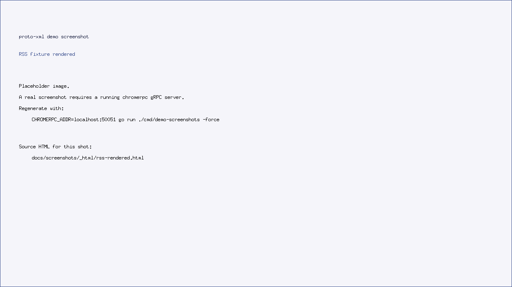
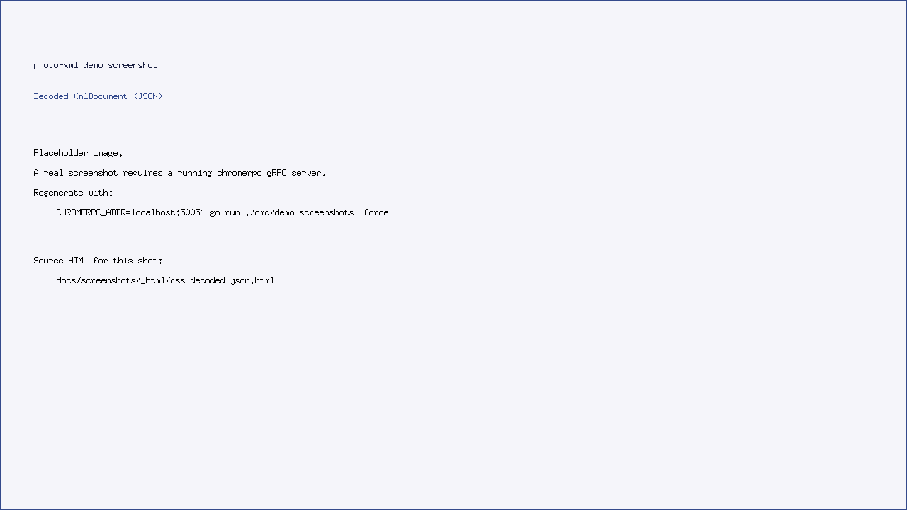
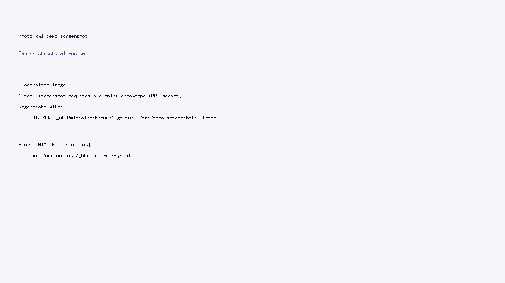

# proto-xml — XML as a typed protobuf

`proto-xml` is a Go codec that converts between raw XML bytes and the
`openformat.v1.XmlDocument` protobuf message defined in
[`accretional/mime-proto`](https://github.com/accretional/mime-proto).

It exists for the same reason any "X as a typed message" library exists: once
your XML is a protobuf, you can ship it through gRPC, store it in a typed
column, diff two versions structurally, fan it out to multiple consumers,
and round-trip back to bytes — all without each consumer re-parsing.

## Why a proto wrapper?

XML is a flexible, lossy-by-default format the moment you reach for any
specific Go struct. `encoding/xml` will happily strip your CDATA, eat your
comments, lose attribute order in some cases, and forget your processing
instructions — none of which is a problem if you only need the data, but a
huge problem if you need to *re-emit* the document or *audit* what was in it.

`proto-xml` keeps the structure (and, via `XmlDocumentWithMetadata.RawBytes`,
the original bytes) so a consumer can:

- inspect any part of the tree as a typed message
- structurally re-emit (`Encode`) — useful when the consumer is rewriting parts
  of the document
- byte-faithfully re-emit (`EncodeMetadata{UseRawBytes: true}`) — useful when
  the consumer is forwarding the original

## A worked example: an RSS feed

The fixture used below is `data/handwritten/09_rss_feed.xml` — a minimal but
realistic RSS 2.0 document.

```go
package main

import (
    "fmt"
    "os"

    "openformat/internal/xmlcodec"
)

func main() {
    src, _ := os.ReadFile("data/handwritten/09_rss_feed.xml")

    md, err := xmlcodec.Decode(src)
    if err != nil {
        panic(err)
    }
    rss := md.Document.DocumentElement
    fmt.Println("root        :", rss.LocalName)              // "rss"
    fmt.Println("version attr:", rss.Attributes[0].NormalizedValue)

    // Walk the channel and print item titles.
    for _, ch := range rss.Children {
        channel := ch.GetElement()
        if channel == nil || channel.LocalName != "channel" {
            continue
        }
        for _, n := range channel.Children {
            item := n.GetElement()
            if item == nil || item.LocalName != "item" {
                continue
            }
            for _, c := range item.Children {
                if e := c.GetElement(); e != nil && e.LocalName == "title" {
                    if txt := e.Children[0].GetText(); txt != nil {
                        fmt.Println("  -", txt.Data)
                    }
                }
            }
        }
    }

    // Re-emit byte-faithfully (forwarding case):
    out, _ := xmlcodec.EncodeMetadata(md, xmlcodec.EncodeOptions{UseRawBytes: true})
    _ = out // == src
}
```

### Mutating + structural re-emit

A real-world feed reader might patch links before re-publishing. Because the
tree is typed, the mutation is a few lines:

```go
for _, n := range item.Children {
    if e := n.GetElement(); e != nil && e.LocalName == "link" {
        if txt := e.Children[0].GetText(); txt != nil {
            txt.Data = rewrite(txt.Data) // e.g. add tracking query params
        }
    }
}

out, _ := xmlcodec.Encode(md.Document) // structural encode, not raw bytes
```

The structural encoder reproduces declaration, namespaces, attributes, CDATA,
comments, and PIs. It does not promise byte-identical output — see
`testing/README.md` for the contract and known limitations.

## Encoder/decoder contract

| Concern                           | Decode preserves it? | Structural Encode preserves it? | Raw-bytes Encode preserves it? |
| --------------------------------- | -------------------- | ------------------------------- | ------------------------------ |
| Element tree + attributes         | yes                  | yes                             | yes                            |
| Namespace declarations            | yes                  | yes                             | yes                            |
| `xml:lang` / `space` / `id` / `base` | yes               | yes                             | yes                            |
| CDATA boundaries                  | yes (offset scan)    | yes                             | yes                            |
| Entity vs char-ref distinction    | yes (`RawPieces`)    | yes (when `RawPieces` set)      | yes                            |
| Comments and PIs                  | yes                  | yes                             | yes                            |
| DOCTYPE name + external IDs       | yes                  | yes                             | yes                            |
| DOCTYPE internal subset           | flag only            | dropped                         | yes                            |
| BOM / declared encoding           | metadata             | UTF-8 declaration               | yes                            |
| Whitespace between prolog items   | no (raw only)        | no                              | yes                            |

## Demo screenshots

The README task list calls for screenshots taken via
[`accretional/chromerpc`](https://github.com/accretional/chromerpc). The
images below are produced by `cmd/demo-screenshots`, which builds three HTML
viewer pages under `docs/screenshots/_html/` and hands them to a chromerpc
gRPC server (by default `localhost:50051`) for capture.

When no chromerpc server is reachable, the command falls back to
placeholder PNGs so the documentation doesn't show broken images. To
regenerate real captures against a running server:

```sh
CHROMERPC_ADDR=localhost:50051 go run ./cmd/demo-screenshots -force
```



*Figure 1.* The raw `data/handwritten/09_rss_feed.xml` fixture rendered by the
browser's built-in XML viewer.



*Figure 2.* The same document after `xmlcodec.Decode`, serialised to JSON via
`protojson`. Notice that comments, PIs, and CDATA appear as first-class nodes
under `children`.



*Figure 3.* `diff` between the original bytes and `xmlcodec.Encode`'s
structural output. Attribute order and whitespace differ in places — both
are documented limitations. Use the raw-bytes encode path when byte-identity
matters.

## Where to go next

- `internal/xmlcodec/` — the codec itself.
- `proto/openformat/v1/xml.proto` — the message definitions
  (vendored from `accretional/mime-proto`).
- `testing/README.md` — full test strategy and the list of known semantic
  discrepancies.
- `README.md` `## NEXT STEPS` — running findings about the format / proto.
